<div align="center">

# 🏍️ Smart Safety Helmet

### Real-Time IoT Accident Detection & Emergency Response System

[](https://www.arduino.cc/)
[](https://react.dev/)
[](https://www.typescriptlang.org/)
[](https://vite.dev/)
[](https://tailwindcss.com/)
[](https://nodejs.org/)
[]()

<br />

> **Many accident victims are unable to call for help due to severe injuries or unconsciousness, leading to critical delays in medical assistance.** This system automatically detects accidents and triggers emergency alerts — reducing response time and potentially saving lives.

<br />

</div>

---

## 📋 Table of Contents

- [Overview](#-overview)
- [Key Features](#-key-features)
- [System Architecture](#-system-architecture)
- [Tech Stack](#-tech-stack)
- [Project Structure](#-project-structure)
- [Getting Started](#-getting-started)
  - [Prerequisites](#prerequisites)
  - [Dashboard (React)](#1-dashboard-react)
  - [Bridge Server (Node.js)](#2-bridge-server-nodejs)
  - [Arduino Firmware](#3-arduino-firmware)
- [Hardware Wiring](#-hardware-wiring)
- [Usage Modes](#-usage-modes)
- [Dashboard Pages](#-dashboard-pages)
- [Arduino Data Protocol](#-arduino-data-protocol)
- [Performance](#-performance)
- [Current Limitations](#-current-limitations)
- [Future Scope](#-future-scope)

---

## 🔭 Overview

The **Smart Safety Helmet** is a Multidisciplinary Project (MDP) that integrates sensors into a safety helmet to continuously monitor a rider's movement. An **MPU6050 accelerometer/gyroscope** detects sudden impacts at **>25 m/s² (≈2.55g)**, triggering a **10-second buzzer alert** with a cancellable countdown.

The system consists of three layers:

| Layer | Tech | Role |
|-------|------|------|
| **Embedded Firmware** | Arduino Uno R3 + C++ | Sensor reading, accident detection, JSON output at 1 Hz |
| **Bridge Server** | Node.js + Express + WebSocket | Serial-to-WebSocket translation, port management, rate limiting |
| **Dashboard** | React 19 + TypeScript + Vite | Real-time visualization, analytics, accident history, PDF/CSV export |

Two operating modes are supported:
- **🧪 Simulation Mode** — No hardware required. Generates realistic GPS/accelerometer data around Chennai, India for development and testing.
- **🔧 Hardware Mode** — Connects to a real Arduino over USB serial and streams live sensor data from the helmet.

---

## ✨ Key Features

### Embedded System
- 🛰️ **GPS Tracking** — NEO-6M module with explicit validity flag (`gv` field)
- 📐 **6-Axis Motion Sensing** — MPU6050 raw I2C reads (±2g default scale)
- ⚠️ **Accident Detection** — 25 m/s² threshold with 10-second alert window
- 🔊 **Buzzer Alert** — 500ms on/off beep pattern during active alert
- 🛑 **Cancel Button** — Hardware debounced (200ms) manual alert cancellation
- 🩺 **Health Reporting** — `mpu` status flag, `ms` uptime, `bat` battery field
- 🧠 **Memory-Safe** — `dtostrf()` 24-byte stack buffers instead of `String()` heap allocations (2KB SRAM safe)
- 🐕 **Watchdog Timer** — 2-second AVR watchdog prevents firmware lockups on I2C bus hang

### Dashboard
- 📊 **Real-Time Metrics** — GPS, speed, altitude, 3-axis acceleration, total accel, system status
- 🗺️ **Live Map** — Interactive Leaflet map with position marker and trail history
- 📈 **Analytics** — 60-second rolling charts for accelerometer, speed, and altitude
- 🚨 **Accident History** — Event log with GPS coordinates, peak acceleration, duration, resolution status
- 📟 **Serial Monitor** — macOS-style terminal with color-coded log messages and scroll-to-bottom indicator
- 🔌 **Hardware Status** — Module connectivity and integration status panel
- 📖 **Documentation** — In-app circuit diagrams, block diagram, flowchart, and roadmap

### UI/UX
- 🌙 **Dark Mode Only** — Optimized dark theme with glass-morphism design and 16 semantic CSS variables
- 🎨 **WCAG AA Compliant** — High-contrast text, accessible colors, `prefers-reduced-motion` support
- 📱 **Mobile Responsive** — Hamburger menu overlay, collapsible sidebar, adaptive grid layouts
- 🎬 **Smooth Animations** — Page transitions, staggered fade-ins, gauge easing, skeleton loading states
- 🔔 **Toast Notifications** — Success/error/warning/info toasts with 4-second auto-dismiss
- ♿ **Accessibility** — Full ARIA labels on all interactive elements, SVG `role="img"`, focus trap modals, `aria-live` regions, keyboard navigation
- 📤 **Data Export** — CSV sensor logs + PDF system reports with try-catch error handling (jsPDF + AutoTable)
- ⚡ **Code-Split Bundle** — Lazy-loaded routes, vendor chunk splitting (81% smaller initial load)
- 🧩 **Reusable Components** — EmptyState, StatusBadge, GlassCard, MetricCard, ImpactMeter, AccelerationGauge

### Server
- 🔄 **Serial ↔ WebSocket Bridge** — Transparent data translation with payload validation
- 🛡️ **Rate Limiting** — 30 requests/minute per IP with periodic auto-cleanup
- 📡 **REST API** — Port listing, connect/disconnect, status endpoints
- 🧹 **Resource Management** — Proper WebSocket cleanup, heartbeat monitoring, graceful shutdown
- ⚠️ **Error Handling** — Express error middleware, serial parser recovery, broadcast try-catch
- 📦 **Request Size Limit** — 10KB JSON body limit to prevent DoS attacks

### Resilience
- 🔁 **Auto-Reconnect** — Exponential backoff (1s → 16s, max 5 attempts) for WebSocket
- 🛡️ **Error Boundary** — React ErrorBoundary catches render crashes with recovery UI
- ✅ **Payload Validation** — Runtime type-checking on all incoming sensor data
- ⏱️ **Fetch Timeout** — 10-second AbortController wrapper prevents hanging requests
- 🚦 **Graceful Shutdown** — Server handles SIGINT/SIGTERM with resource cleanup + 5s force-exit
- 🧹 **Memory Safety** — setTimeout refs tracked and cleaned up on component unmount
- 📦 **IndexedDB Cleanup** — Proper `db.close()` on all error paths

### Code Quality
- 🧪 **Testing Infrastructure** — Vitest + React Testing Library + jsdom environment ready
- 🔍 **Accessibility Linting** — `eslint-plugin-jsx-a11y` enforces WCAG compliance
- 📝 **TypeScript Strict Mode** — Full type safety with `noUnusedLocals`, `noUnusedParameters`
- 🚫 **No Console Logs** — ESLint `no-console` rule (warn level, allow warn/error)
- 📊 **Named Constants** — Magic numbers extracted to descriptive constants
- 🔒 **Secrets Protected** — `.gitignore` includes all `.env` patterns

---

## 🔄 State Management & Data Flow

### Global State (AppContext)

The application uses **React Context** for global state management, avoiding prop drilling across deeply nested components.

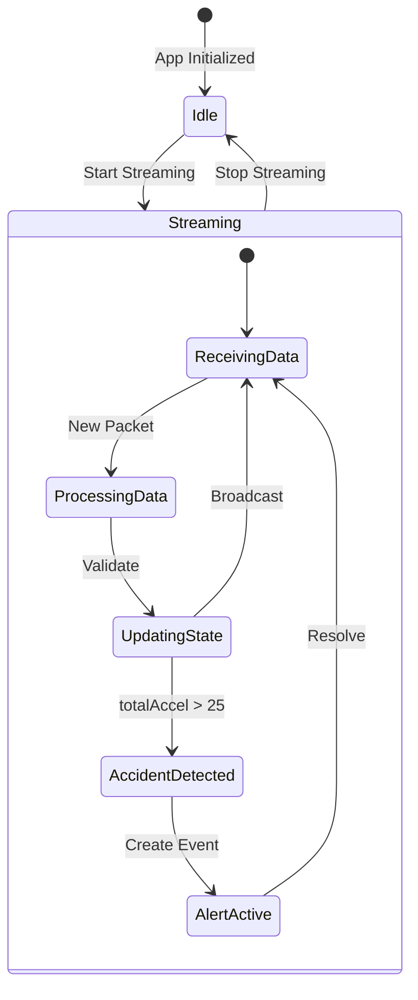

### State Shape

```typescript
interface AppState {
  // Connection State
  dataMode: 'simulation' | 'hardware';
  isStreaming: boolean;
  connectionStatus: 'connected' | 'disconnected' | 'connecting' | 'error';
  
  // Sensor Data
  sensorData: SensorData | null;           // Latest reading
  sensorHistory: SensorData[];             // Last 60 readings
  gpsTrail: [number, number][];            // Last 100 GPS points
  
  // Accident Tracking
  accidentEvents: AccidentEvent[];         // All detected incidents
  activeAlert: AccidentEvent | null;       // Currently active alert
  
  // UI State
  theme: 'dark' | 'light';
  serialLogs: LogMessage[];                // Last 200 log messages
  
  // Hardware State (hardware mode only)
  availablePorts: string[];
  selectedPort: string | null;
}
```

### Data Flow Diagram

```mermaid
flowchart TD
    subgraph Sources["📡 Data Sources"]
        SIM["🧪 Simulator<br/><i>In-memory generator</i>"]
        HW["🔧 Arduino<br/><i>USB Serial</i>"]
    end
    
    subgraph Bridge["🖥️ Bridge Server"]
        SERIAL["SerialPort<br/><i>ReadlineParser</i>"]
        TRANSFORM["transformData()<br/><i>Key mapping</i>"]
        WS_SERVER["WebSocket Server<br/><i>Broadcast</i>"]
    end
    
    subgraph Client["🖼️ React Dashboard"]
        WS_CLIENT["useSerialConnection<br/><i>WebSocket client</i>"]
        VALIDATE["Payload Validation<br/><i>Type checking</i>"]
        CONTEXT["AppContext<br/><i>Global state</i>"]
        
        subgraph Consumers["📊 State Consumers"]
            DASH["Dashboard"]
            MAP["LiveMap"]
            SENS["SensorData"]
            ANAL["Analytics"]
            ACC["AccidentHistory"]
        end
    end
    
    SIM -->|"Direct update"| CONTEXT
    HW -->|"9600 baud"| SERIAL
    SERIAL -->|"JSON lines"| TRANSFORM
    TRANSFORM --> WS_SERVER
    WS_SERVER -->|"ws://localhost:3001/ws"| WS_CLIENT
    WS_CLIENT --> VALIDATE
    VALIDATE -->|"✅ Valid"| CONTEXT
    VALIDATE -->|"❌ Invalid"| ERROR["Error Toast"]
    
    CONTEXT --> Consumers
    
    style Sources fill:#2e1f0a,stroke:#f59e0b
    style Bridge fill:#0a2e2e,stroke:#10b981
    style Client fill:#1a2744,stroke:#3b82f6
```

### Real-Time Update Sequence

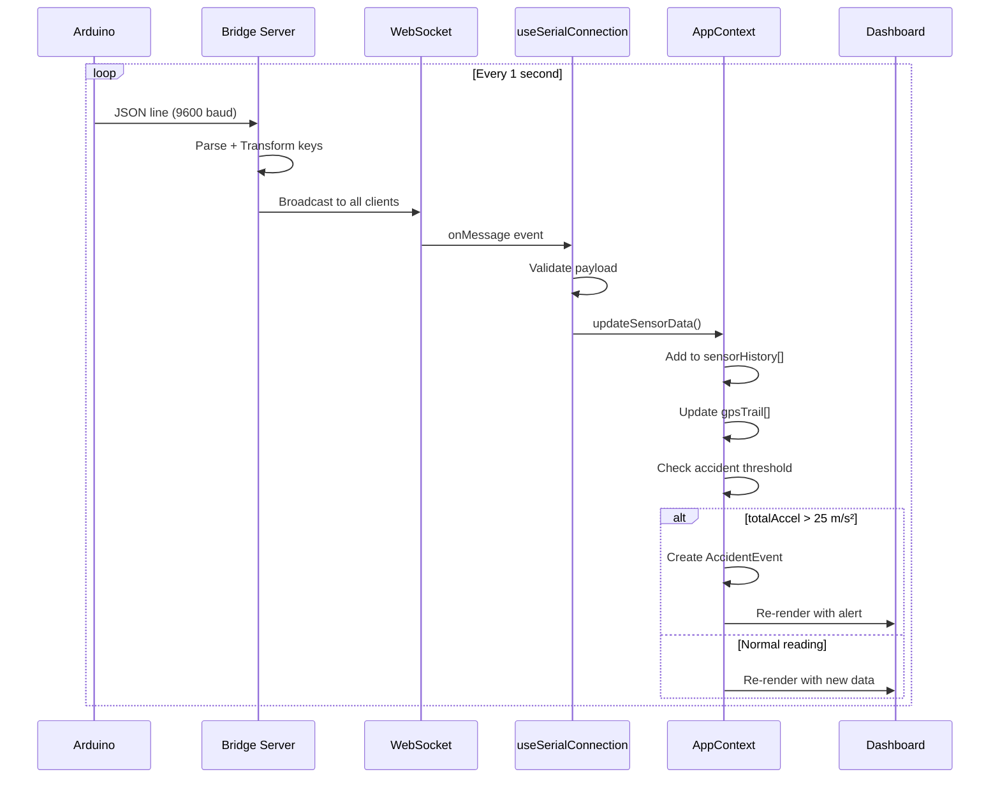

### Context Provider Pattern

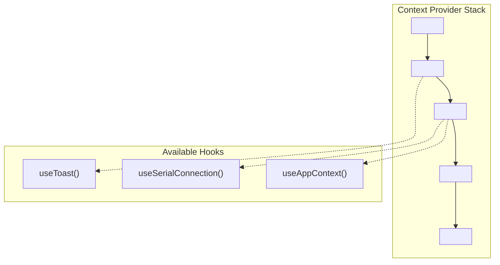

---

## 🏗️ System Architecture

### Hardware Mode — Full Data Flow

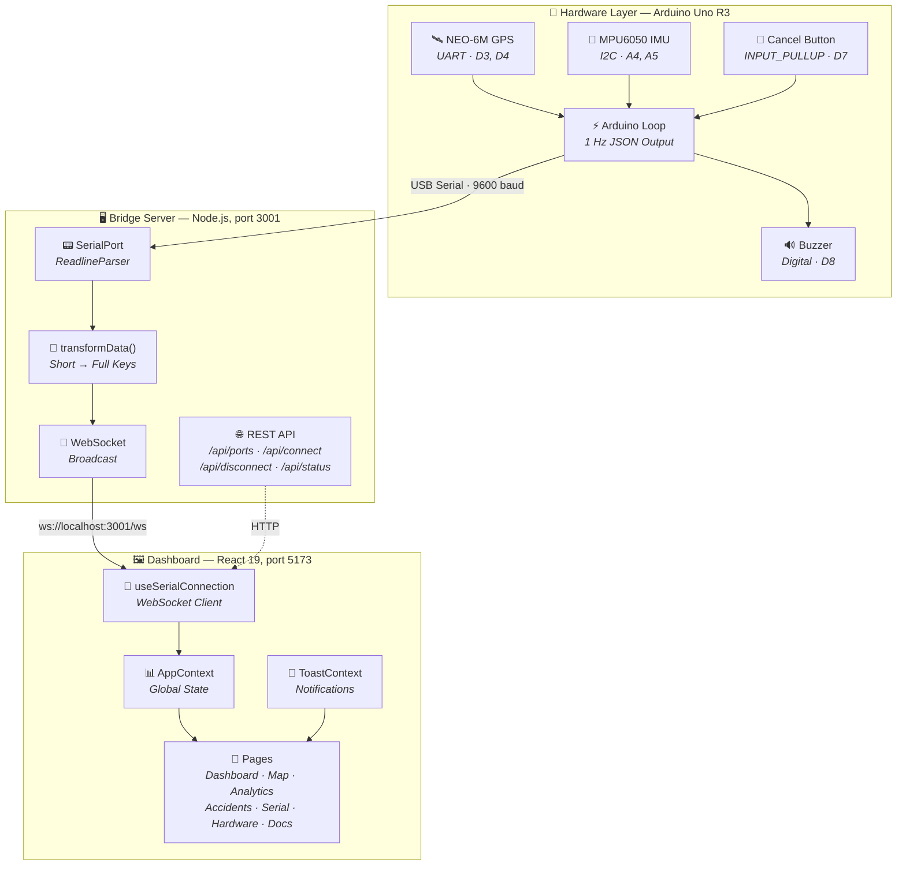

### Simulation Mode

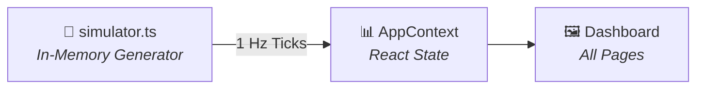

### Accident Detection Flow

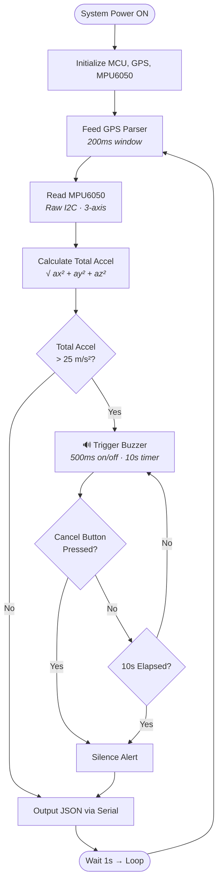

---

## 🧰 Tech Stack

<table>
<tr><th>Layer</th><th>Technology</th><th>Version</th><th>Purpose</th></tr>
<tr><td rowspan="8"><strong>Frontend</strong></td><td>React</td><td>19.2</td><td>UI framework</td></tr>
<tr><td>TypeScript</td><td>5.9</td><td>Type safety</td></tr>
<tr><td>Vite</td><td>7.2</td><td>Build tool & dev server</td></tr>
<tr><td>Tailwind CSS</td><td>4.1</td><td>Utility-first CSS</td></tr>
<tr><td>React Router</td><td>7.13</td><td>Client-side routing</td></tr>
<tr><td>Recharts</td><td>3.7</td><td>Data visualization</td></tr>
<tr><td>Leaflet + React-Leaflet</td><td>1.9 / 5.0</td><td>Interactive maps</td></tr>
<tr><td>jsPDF + AutoTable</td><td>4.1 / 5.0</td><td>PDF report generation</td></tr>
<tr><td rowspan="4"><strong>Server</strong></td><td>Node.js</td><td>18+</td><td>Runtime</td></tr>
<tr><td>Express</td><td>4.21</td><td>REST endpoints</td></tr>
<tr><td>ws</td><td>8.18</td><td>WebSocket server</td></tr>
<tr><td>serialport</td><td>12.0</td><td>USB serial communication</td></tr>
<tr><td rowspan="4"><strong>Firmware</strong></td><td>Arduino Uno R3</td><td>—</td><td>MCU (ATmega328P, 2KB SRAM)</td></tr>
<tr><td>TinyGPS++</td><td>Latest</td><td>NMEA GPS parsing</td></tr>
<tr><td>ArduinoJson</td><td>6.x</td><td>JSON serialization</td></tr>
<tr><td>Wire.h</td><td>Built-in</td><td>I2C communication</td></tr>
</table>

---

## 📁 Project Structure

```
mdp/
├── arduino/
│   └── mdp_firmware/
│       └── mdp_firmware.ino        # Arduino sketch (GPS + MPU6050 + accident detection)
│
├── server/
│   ├── server.js                   # Bridge server (serial ↔ WebSocket + REST API)
│   └── package.json                # Server dependencies
│
├── src/
│   ├── components/
│   │   ├── AccelerationGauge.tsx   # SVG circular gauge (0-30 m/s², 3-zone colors)
│   │   ├── CircuitSchematic.tsx    # Breadboard-style SVG wiring diagram
│   │   ├── ConnectionPanel.tsx     # Serial port connection UI
│   │   ├── DashboardLayout.tsx     # Responsive layout with sidebar + mobile menu
│   │   ├── EmptyState.tsx          # Reusable loading/empty state with skeleton placeholders
│   │   ├── GlassCard.tsx           # Glass-morphism container component
│   │   ├── ImpactMeter.tsx         # Semicircular severity gauge (0-100%)
│   │   ├── MetricCard.tsx          # Data display card with icon + pulse indicator
│   │   ├── NavDrawer.tsx           # Mobile navigation overlay drawer
│   │   ├── Sidebar.tsx             # Desktop navigation, mode toggle, exports
│   │   └── StatusBadge.tsx         # Color-coded status indicators
│   │
│   ├── context/
│   │   ├── AppContext.tsx          # Global state (sensors, mode, accidents)
│   │   └── ToastContext.tsx        # Toast notification system
│   │
│   ├── hooks/
│   │   ├── useSerialConnection.ts  # WebSocket client hook (auto-reconnect, backoff)
│   │   ├── useAccidentDetection.ts # Accident detection state machine
│   │   ├── useGPSStatus.ts         # GPS lock status tracking
│   │   ├── useFocusTrap.ts         # WCAG-compliant modal focus trap
│   │   └── useOfflineStore.ts      # IndexedDB offline data persistence
│   │
│   ├── test/
│   │   └── setup.ts                # Vitest setup with browser mocks
│   │
│   ├── pages/
│   │   ├── Dashboard.tsx           # Main metrics dashboard (grid layout)
│   │   ├── LandingPage.tsx         # Welcome page with feature showcase
│   │   ├── LiveMap.tsx             # GPS map with trail (lazy-loaded)
│   │   ├── SensorData.tsx          # Severity meter + accelerometer readings
│   │   ├── Analytics.tsx           # Rolling charts (lazy-loaded)
│   │   ├── AccidentHistory.tsx     # Event log with stats (lazy-loaded)
│   │   ├── SerialMonitor.tsx       # Terminal viewer with scroll-to-bottom
│   │   ├── HardwareStatus.tsx      # Module status panel
│   │   ├── Documentation.tsx       # In-app docs with diagrams
│   │   ├── ValidationLogs.tsx      # Data validation monitoring
│   │   ├── LoadTesting.tsx         # Performance benchmarking
│   │   └── Onboarding.tsx          # First-time user tutorial
│   │
│   ├── constants/
│   │   └── hardware.ts             # Hardware module definitions
│   │
│   ├── types/
│   │   └── index.ts                # TypeScript interfaces
│   │
│   └── utils/
│       ├── simulator.ts            # Simulation data generator
│       ├── reportGenerator.ts      # PDF report generation
│       └── incidentReport.ts       # Incident CSV/PDF export
│
├── public/                         # Static assets
├── index.html                      # Entry HTML
├── vite.config.ts                  # Vite config with vendor splitting
├── vitest.config.ts                # Vitest test runner config
├── tsconfig.json                   # TypeScript base config
├── tsconfig.app.json               # App TS config (verbatimModuleSyntax)
├── eslint.config.js                # ESLint flat config with jsx-a11y
└── package.json                    # Frontend dependencies
```

---

## 🧩 Component Architecture

The React application follows a **layered architecture** with clear separation of concerns:

```mermaid
graph TD
    subgraph Entry["📱 Entry Point"]
        MAIN["main.tsx<br/><i>React 19 Root</i>"]
        APP["App.tsx<br/><i>Router + Providers</i>"]
    end
    
    subgraph Providers["🔄 Context Providers"]
        TOAST_CTX["ToastContext<br/><i>Notifications</i>"]
        APP_CTX["AppContext<br/><i>Global State</i>"]
    end
    
    subgraph Layout["📐 Layout Layer"]
        DASH_LAYOUT["DashboardLayout<br/><i>Sidebar + Main Area</i>"]
        SIDEBAR["Sidebar<br/><i>Desktop Nav</i>"]
        NAV_DRAWER["NavDrawer<br/><i>Mobile Nav</i>"]
    end
    
    subgraph Pages["📄 Page Components"]
        LANDING["LandingPage"]
        DASHBOARD["Dashboard"]
        LIVEMAP["LiveMap"]
        SENSORS["SensorData"]
        ANALYTICS["Analytics"]
        ACCIDENTS["AccidentHistory"]
        SERIAL["SerialMonitor"]
        HARDWARE["HardwareStatus"]
        DOCS["Documentation"]
    end
    
    subgraph Components["🧱 Reusable Components"]
        GLASS["GlassCard"]
        METRIC["MetricCard"]
        GAUGE["AccelerationGauge"]
        IMPACT["ImpactMeter"]
        STATUS["StatusBadge"]
        EMPTY["EmptyState"]
        CONN["ConnectionPanel"]
        CIRCUIT["CircuitSchematic"]
    end
    
    MAIN --> APP
    APP --> TOAST_CTX
    TOAST_CTX --> APP_CTX
    APP_CTX --> DASH_LAYOUT
    DASH_LAYOUT --> SIDEBAR
    DASH_LAYOUT --> NAV_DRAWER
    DASH_LAYOUT --> Pages
    
    Pages --> Components
    
    style Entry fill:#1a2744,stroke:#3b82f6
    style Providers fill:#2e1f0a,stroke:#f59e0b
    style Layout fill:#0a2e2e,stroke:#10b981
    style Pages fill:#2e0a2e,stroke:#a855f7
    style Components fill:#2e0a0a,stroke:#ef4444
```

### Component Hierarchy

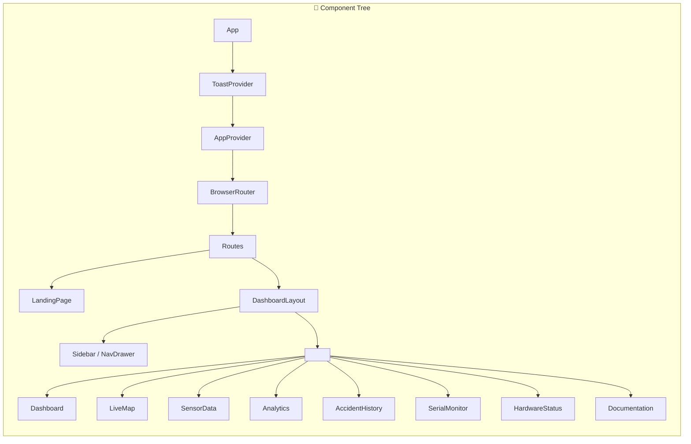

### Key Components Explained

| Component | Purpose | Props | Notes |
|-----------|---------|-------|-------|
| **GlassCard** | Glass-morphism container | `className`, `children` | Semi-transparent background with blur |
| **MetricCard** | Data display with icon | `icon`, `label`, `value`, `unit`, `trend` | Supports pulse animation |
| **AccelerationGauge** | Circular SVG gauge | `value`, `max`, `zones` | 0-30 m/s² with color zones |
| **ImpactMeter** | Severity gauge | `value`, `rawAcceleration`, `zone` | Semicircular with needle |
| **StatusBadge** | Status indicator | `status`, `size` | Auto-colors by status type |
| **EmptyState** | Loading/empty UI | `icon`, `title`, `message` | With skeleton placeholders |
| **ConnectionPanel** | Serial port UI | — | Port selection + connect/disconnect |
| **CircuitSchematic** | Wiring diagram | — | Interactive SVG schematic |

---

## 🚀 Getting Started

### Prerequisites

| Tool | Version | Required For |
|------|---------|-------------|
| [Node.js](https://nodejs.org/) | 18+ | Dashboard + Bridge Server |
| [npm](https://www.npmjs.com/) | Included with Node.js | Package management |
| [Arduino IDE](https://www.arduino.cc/en/software) | 2.x | Flashing firmware (hardware mode only) |

### 1. Dashboard (React)

```bash
# Clone and install
git clone https://github.com/pratyushdeosingh/mdp.git
cd mdp
npm install

# Start development server
npm run dev
```

Opens at **http://localhost:5173** — works immediately in Simulation Mode.

### 2. Bridge Server (Node.js)

> Only needed for Hardware Mode. Skip this for simulation.

```bash
cd server
npm install
node server.js
```

```
╔══════════════════════════════════════════════════╗
║   MDP IoT Serial Bridge Server                   ║
║   Running on http://localhost:3001               ║
║                                                    ║
║   REST:  http://localhost:3001/api/ports         ║
║   WS:    ws://localhost:3001/ws                  ║
╚══════════════════════════════════════════════════╝
```

### 3. Arduino Firmware

1. Open `arduino/mdp_firmware/mdp_firmware.ino` in the Arduino IDE
2. Install required libraries via **Library Manager**:
   - `TinyGPS++` by Mikal Hart
   - `ArduinoJson` by Benoît Blanchon (v6.x)
3. Select **Arduino Uno** as the board
4. Select the correct COM port
5. Click **Upload**
6. Verify output at `9600` baud in Serial Monitor

---

## 🔌 Hardware Wiring

### Circuit Diagram

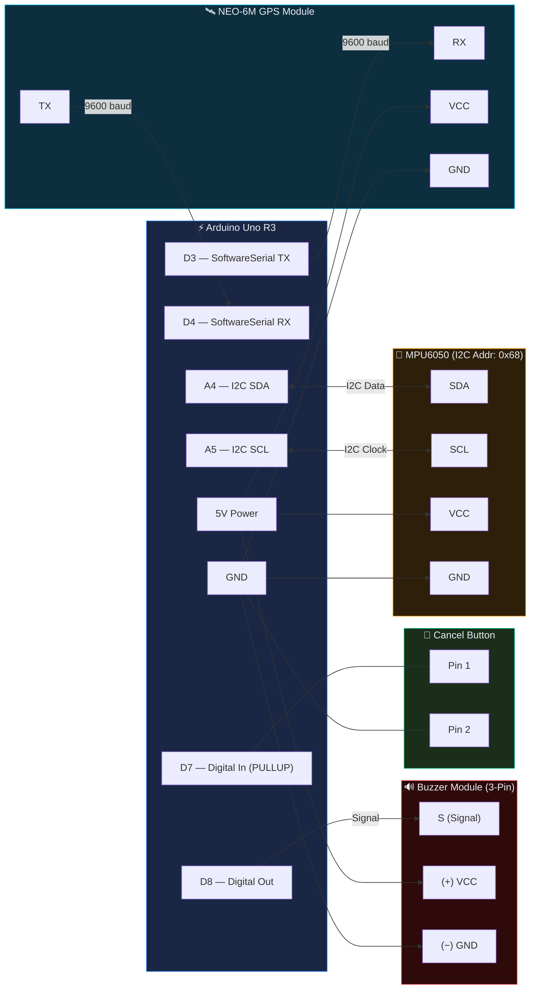

### Pin Mapping Table

| Component | Arduino Pin | Interface | Direction | Notes |
|-----------|-------------|-----------|-----------|-------|
| NEO-6M GPS TX | **D4** | SoftwareSerial RX | GPS → Arduino | 9600 baud UART |
| NEO-6M GPS RX | **D3** | SoftwareSerial TX | Arduino → GPS | 9600 baud UART |
| MPU6050 SDA | **A4** | I2C Data | Bidirectional | Address: `0x68` |
| MPU6050 SCL | **A5** | I2C Clock | Bidirectional | |
| Buzzer Signal (S) | **D8** | Digital Out | Arduino → Buzzer | Signal pin, 500ms on/off pattern |
| Buzzer Power (+) | **5V** | Power | Arduino → Buzzer | VCC pin |
| Buzzer Ground (−) | **GND** | Ground | — | GND pin |
| Cancel Button Pin 1 | **D7** | Digital In | Button → Arduino | `INPUT_PULLUP`, active LOW |
| Cancel Button Pin 2 | **GND** | Ground | — | Connect other leg to GND |
| NEO-6M VCC | **5V** | Power | Arduino → GPS | 3.3V or 5V depending on module |
| MPU6050 VCC | **5V** | Power | Arduino → MPU | 3.3V or 5V depending on module |

> ⚡ Power MPU6050 and NEO-6M from Arduino **3.3V or 5V** depending on your module variant. Both share the same power rail.

---

## 🎮 Usage Modes

### 🧪 Simulation Mode (No Hardware)

1. Run `npm run dev`
2. Open **http://localhost:5173**
3. Select **Simulation Mode** on the landing page
4. Click **Start Streaming** — simulated data flows immediately

The simulator generates GPS coordinates around **Chennai, India** with realistic accelerometer noise and periodic accident events.

### 🔧 Hardware Mode (Arduino Connected)

1. Flash the Arduino firmware (see above)
2. Connect Arduino to PC via USB
3. Start the bridge server: `cd server && node server.js`
4. Start the dashboard: `npm run dev` (from project root)
5. Open **http://localhost:5173**
6. Select **Hardware Mode**
7. Click **Refresh Ports** → select your COM port → **Connect**
8. Live sensor data streams at 1 Hz

---

## 📄 Dashboard Pages — Detailed Guide

The dashboard is organized into **10 primary pages** accessible via the sidebar navigation. Each page serves a specific purpose in the helmet monitoring ecosystem.

### Navigation Overview

```mermaid
graph TD
    subgraph Navigation["📍 Dashboard Navigation"]
        LAND["🏠 Landing Page"]
        DASH["📊 Dashboard"]
        MAP["🗺️ Live Map"]
        SENS["📡 Sensor Data"]
        ANAL["📈 Analytics"]
        ACC["🚨 Accident History"]
        SER["📟 Serial Monitor"]
        HW["🔌 Hardware Status"]
        DOC["📖 Documentation"]
        VALID["✅ Validation Logs"]
        LOAD["⚡ Load Testing"]
        ONBD["🎓 Onboarding"]
    end
    
    LAND --> DASH
    DASH --> MAP
    DASH --> SENS
    DASH --> ANAL
    DASH --> ACC
    DASH --> SER
    DASH --> HW
    DASH --> DOC
    DASH --> VALID
    DASH --> LOAD
    DASH --> ONBD
    
    style LAND fill:#1a2744,stroke:#3b82f6
    style DASH fill:#0a2e2e,stroke:#10b981
    style SENS fill:#2e1f0a,stroke:#f97316
```

---

### 🏠 Landing Page (`/`)

**Purpose:** Welcome screen and mode selection hub

The landing page is the entry point to the application, designed to onboard new users and allow returning users to quickly jump into their preferred mode.

**Key Sections:**
| Section | Description |
|---------|-------------|
| **Hero Banner** | Animated tagline with project branding and call-to-action buttons |
| **Mode Selection** | Two large cards: 🧪 **Simulation Mode** (no hardware) and 🔧 **Hardware Mode** (Arduino connected) |
| **Feature Showcase** | Grid of 6 feature cards with icons highlighting key capabilities |
| **Tech Stack** | Logos for Arduino, React, TypeScript, Node.js with brief descriptions |
| **How It Works** | 3-step visual flow showing the accident detection pipeline |

**User Flow:**
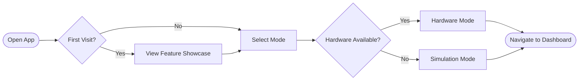

---

### 📊 Dashboard (`/dashboard`)

**Purpose:** Central command center with all key metrics at a glance

The main dashboard uses a responsive **12-column CSS Grid** layout that adapts from mobile to desktop. This is where operators spend most of their time monitoring the helmet's status.

**Layout Structure:**
```
┌─────────────────────────────────────────────────────────┐
│                   📍 Hero Status Card                   │  ← 8 cols, 2 rows
│     Connection Status · GPS Coordinates · Speed         │
│     Altitude · Last Update · Streaming Status           │
├───────────────────┬─────────────────────────────────────┤
│  🎯 Severity      │       ⚡ Quick Stats                │  ← 4 cols each
│     Meter         │   Battery · MPU · Uptime            │
├───────────────────┴─────────────────────────────────────┤
│            🚨 Active Alert Banner (if accident)         │  ← Full width
├─────────────────────────────────────────────────────────┤
│  📐 Accelerometer │  📊 Circular  │  🗺️ Mini Map       │  ← 4 cols each
│     X, Y, Z       │     Gauge     │    Preview          │
└─────────────────────────────────────────────────────────┘
```

**Key Components:**

| Component | Description | Real-Time Updates |
|-----------|-------------|-------------------|
| **Hero Status Card** | Large card spanning 8 columns showing primary helmet status with connection indicator, GPS coordinates (lat/lng), current speed, altitude, and last update timestamp | ✅ 1 Hz |
| **Severity Meter** | Circular gauge (0-100%) showing impact intensity with color-coded zones (Safe, Caution, Danger) | ✅ 1 Hz |
| **Quick Stats** | Battery percentage, MPU6050 status, system uptime in compact cards | ✅ 1 Hz |
| **Alert Banner** | Full-width red banner that appears when an accident is detected, with dismiss button and auto-resolve countdown | ✅ Event-driven |
| **Accelerometer Display** | Three cards showing X, Y, Z axis values with visual bars | ✅ 1 Hz |
| **Circular Gauge** | SVG donut chart showing total acceleration from 0-30 m/s² | ✅ 1 Hz |
| **Mini Map** | Leaflet map preview showing current GPS position | ✅ 1 Hz |

**Accident Alert Behavior:**
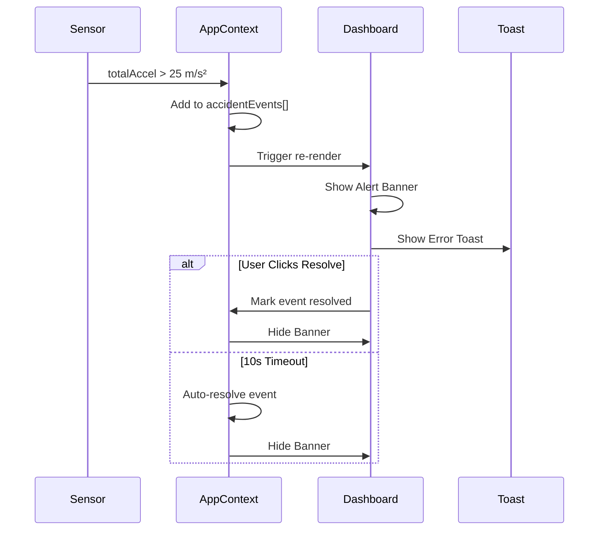

---

### 🗺️ Live Map (`/map`)

**Purpose:** Real-time GPS tracking with movement history

The map page provides a full-screen interactive map powered by **Leaflet** and **React-Leaflet**. It shows the helmet's current position and a trail of recent positions.

**Layout:** Full-page split view
```
┌────────────────────────────────┬─────────────┐
│                                │ 📊 Stats    │
│                                │ ─────────── │
│        🗺️ Interactive Map     │ Lat: 13.08  │
│            (3/4 width)        │ Lng: 80.27  │
│                                │ Speed: 45   │
│                                │ Alt: 120m   │
│                                │ ─────────── │
│                                │ 📍 Trail    │
│                                │ 45 points   │
└────────────────────────────────┴─────────────┘
```

**Features:**

| Feature | Description |
|---------|-------------|
| **Live Position Marker** | Blue pulsing marker at current GPS coordinates, updates at 1 Hz |
| **Movement Trail** | Polyline connecting last 100 GPS positions, shows recent path |
| **Trail History Card** | Shows count of waypoints in the current trail |
| **Map Controls** | Zoom in/out, reset view, layer selection (street/satellite) |
| **Auto-Center** | Map automatically pans to keep the marker in view |
| **Offline Tiles** | Caches recently viewed tiles for offline use |

**Map Interaction:**
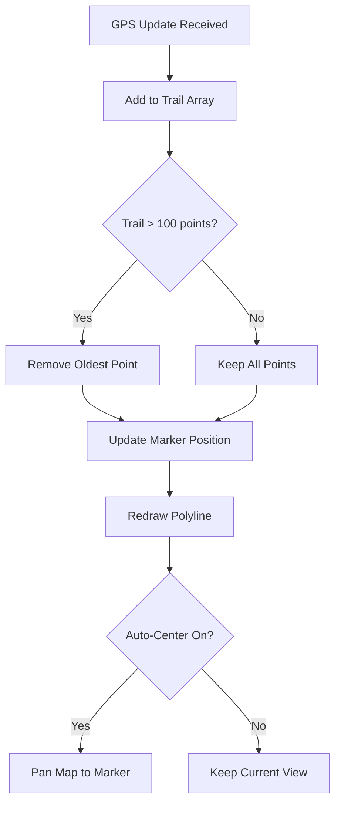

---

### 📡 Sensor Data (`/sensors`)

**Purpose:** Dedicated view for raw sensor readings and impact severity

This page is designed for **technical users** who need to see the raw accelerometer data and understand the severity calculation.

**Layout:**
```
┌─────────────────────────────────────────────────────────┐
│ 📡 Sensor Data                                          │
│ Real-time MPU6050 readings and impact severity analysis │
├─────────────────────────────────────────────────────────┤
│                                                         │
│    ┌───────────────────────────────────────────────┐   │
│    │           🎯 Severity Meter                    │   │
│    │                                               │   │
│    │         ╭───────────────────╮                 │   │
│    │        ╱   ◉ SAFE ZONE ◉    ╲                │   │
│    │       ╱      32% (9.8 m/s²)  ╲               │   │
│    │      ╱                        ╲              │   │
│    │     ╰──────────────────────────╯             │   │
│    │                                               │   │
│    │  🟢 Safe: 0-12    🟡 Caution: 12-25    🔴 Danger: 25+  │
│    └───────────────────────────────────────────────┘   │
│                                                         │
├─────────────────────────────────────────────────────────┤
│                                                         │
│  ┌─────────────────┐  ┌─────────────────┐  ┌─────────────────┐
│  │   📐 Axis X     │  │   📐 Axis Y     │  │   📐 Axis Z     │
│  │                 │  │                 │  │                 │
│  │   ████████░░░   │  │   ███░░░░░░░░   │  │   ██████████    │
│  │   +0.52 m/s²    │  │   -0.18 m/s²    │  │   +9.78 m/s²    │
│  │   Range: ±20    │  │   Range: ±20    │  │   Range: ±20    │
│  └─────────────────┘  └─────────────────┘  └─────────────────┘
│                                                         │
└─────────────────────────────────────────────────────────┘
```

**Severity Zones Explained:**

| Zone | Threshold | Color | Description |
|------|-----------|-------|-------------|
| **Safe** | 0 – 12 m/s² | 🟢 Green | Normal riding conditions, minor vibrations |
| **Caution** | 12 – 25 m/s² | 🟡 Amber | Rough terrain, hard braking, or bumps — no alert triggered |
| **Danger** | 25+ m/s² | 🔴 Red | Potential impact detected — accident alert triggered |

**ImpactMeter Component:**
- Semicircular SVG gauge from 0° to 180°
- Needle animation with easing for smooth transitions
- Zone arc coloring (green → yellow → red gradient)
- Digital readout showing percentage and raw m/s² value
- Zone indicator badge below the gauge

---

### 📈 Analytics (`/analytics`)

**Purpose:** Time-series visualization of sensor data

The analytics page renders **6 interactive charts** using **Recharts**, showing the last 60 seconds of telemetry data.

**Charts Available:**

| Chart | Type | Data | Purpose |
|-------|------|------|---------|
| **Accelerometer XYZ** | Line Chart | `accX`, `accY`, `accZ` | Monitor individual axis movement patterns |
| **Speed** | Area Chart | `speed` (km/h) | Track velocity changes over time |
| **Altitude** | Area Chart | `altitude` (m) | Monitor elevation changes |
| **Total Acceleration** | Area Chart | `totalAccel` (m/s²) | Key safety metric for accident detection |
| **Severity Distribution** | Pie Chart | Incident counts by severity | Overview of incident severity breakdown |
| **Incidents by Hour** | Bar Chart | Hourly incident count | Identify accident-prone time periods |

**Data Flow:**
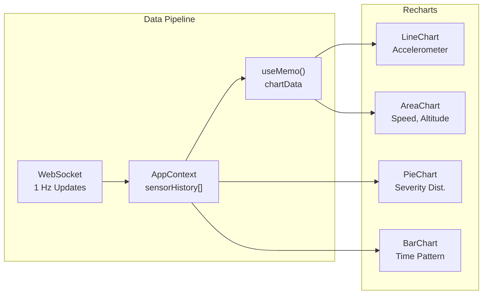

**Chart Styling:**
- Dark-themed tooltips with rounded corners and shadows
- Axis labels in secondary text color for readability
- Gradient fills for area charts (opacity 30% → 0%)
- Smooth curve interpolation (`type="monotone"`)
- Animated entry with staggered timing

---

### 🚨 Accident History (`/accidents`)

**Purpose:** Complete log of detected accident events

This page maintains a chronological record of all accident events with full sensor snapshots.

**Layout:**
```
┌─────────────────────────────────────────────────────────┐
│ 🚨 Accident History                [Export PDF] [CSV]  │
│ All detected accident events with timestamps           │
├─────────────────────────────────────────────────────────┤
│  ⚫ 3 Active    ⚪ 12 Resolved                          │
├─────────────────────────────────────────────────────────┤
│                                                         │
│  ┌─────────┐  ┌─────────┐  ┌─────────┐                 │
│  │ Total   │  │ Peak    │  │ Mode    │                 │
│  │ Events  │  │ Accel   │  │         │                 │
│  │   15    │  │ 38.2    │  │  SIM    │                 │
│  └─────────┘  └─────────┘  └─────────┘                 │
│                                                         │
├─────────────────────────────────────────────────────────┤
│                                                         │
│  ┌──────────────────────────────────────────────────┐  │
│  │ 🔴 Event #15                          [ACTIVE]   │  │
│  │ 2:34:56 PM — Jan 15, 2025                        │  │
│  ├──────────────────────────────────────────────────┤  │
│  │ 📍 13.0827°, 80.2707°  ⚡ 45.2 km/h              │  │
│  │ 📐 Total: 38.24 m/s²   ⏱️ Ongoing                │  │
│  ├──────────────────────────────────────────────────┤  │
│  │ Acc X: +2.450 m/s²  Y: -1.230 m/s²  Z: +37.82   │  │
│  └──────────────────────────────────────────────────┘  │
│                                                         │
│  ┌──────────────────────────────────────────────────┐  │
│  │ ✅ Event #14                         [RESOLVED]  │  │
│  │ ...                                              │  │
│  └──────────────────────────────────────────────────┘  │
│                                                         │
└─────────────────────────────────────────────────────────┘
```

**Event Data Captured:**

| Field | Description |
|-------|-------------|
| `id` | Auto-incrementing event ID |
| `timestamp` | Unix timestamp when accident was detected |
| `gps` | Full GPS snapshot (lat, lng, speed, altitude) |
| `accelerometer` | Raw X, Y, Z values at moment of impact |
| `totalAcceleration` | Computed magnitude (√x² + y² + z²) |
| `resolved` | Boolean indicating if event was acknowledged |
| `resolvedAt` | Timestamp when resolved (manual or auto) |

**Export Options:**
- **PDF Report** — Generated via jsPDF with AutoTable, includes summary statistics and event details
- **CSV Export** — Raw data export for spreadsheet analysis

---

### 📟 Serial Monitor (`/serial`)

**Purpose:** Raw communication logs for debugging

A macOS-style terminal interface showing all messages received from the Arduino or simulator.

**Features:**

| Feature | Description |
|---------|-------------|
| **Color-Coded Logs** | Boot messages (blue), data packets (green), errors (red), warnings (amber) |
| **Timestamp Prefix** | Each line prefixed with `HH:MM:SS.mmm` |
| **Auto-Scroll** | Automatically scrolls to newest message, with manual scroll lock |
| **Scroll-to-Bottom Button** | Floating button appears when scrolled up |
| **Log Limit** | Last 200 messages (configurable) to prevent memory issues |
| **Copy to Clipboard** | Click any line to copy its content |

**Log Message Types:**
```
[12:34:56.789] [BOOT] MDP firmware ready
[12:34:57.234] [DATA] {"lat":13.08,"lng":80.27,"spd":45.2,...}
[12:34:58.456] [WARN] GPS fix lost
[12:34:59.123] [ERROR] MPU6050 not responding
```

---

### 🔌 Hardware Status (`/hardware`)

**Purpose:** Module connectivity and integration overview

Visual status panel showing the connection state of each hardware module.

**Module Status Cards:**

| Module | Status Indicators | Description |
|--------|-------------------|-------------|
| **GPS (NEO-6M)** | 🟢 Connected, 🟡 No Fix, 🔴 Disconnected | Satellite lock status and coordinate validity |
| **MPU6050** | 🟢 Active, 🔴 Fault | Accelerometer/gyroscope I2C communication |
| **Buzzer** | 🟢 Ready, 🟡 Sounding, 🔴 Fault | Alert system status |
| **Cancel Button** | 🟢 Ready, 🔴 Stuck | Hardware debounce status |
| **Serial Port** | 🟢 Connected, 🔴 Disconnected | USB serial connection to bridge server |
| **WebSocket** | 🟢 Connected, 🟡 Reconnecting, 🔴 Disconnected | Real-time data stream status |

**Circuit Visualization:**
The page includes an interactive circuit schematic (SVG) showing the Arduino wiring diagram with clickable components.

---

### 📖 Documentation (`/docs`)

**Purpose:** In-app reference documentation

Comprehensive documentation embedded within the application, including:

| Section | Content |
|---------|---------|
| **Project Abstract** | Academic summary of the project goals and methodology |
| **Architecture Overview** | Block diagrams and data flow explanations |
| **Circuit Diagrams** | Detailed wiring schematics (SVG) |
| **Data Protocol** | JSON schema and field descriptions |
| **Flowcharts** | Algorithm flowcharts for accident detection |
| **Future Roadmap** | Planned features and improvements |

---

### ✅ Validation Logs (`/validation`)

**Purpose:** System health and data integrity monitoring

Technical page showing validation results for incoming data packets.

**Validation Checks:**

| Check | Description | Status |
|-------|-------------|--------|
| **JSON Parse** | Incoming packet is valid JSON | ✅/❌ |
| **Schema Validation** | All required fields present | ✅/❌ |
| **Range Checks** | Values within expected bounds | ✅/❌ |
| **GPS Validity** | Coordinates are realistic | ✅/❌ |
| **Timestamp Continuity** | No large gaps in data stream | ✅/❌ |

---

### ⚡ Load Testing (`/load-testing`)

**Purpose:** Performance benchmarking tools

Developer tools for stress-testing the dashboard under high data rates.

**Features:**
- Adjustable update frequency (1 Hz → 60 Hz)
- Memory usage monitoring
- Frame rate (FPS) counter
- Render time profiling
- WebSocket message queue depth

---

### 🎓 Onboarding (`/onboarding`)

**Purpose:** First-time user tutorial

Guided walkthrough for new users, explaining:
1. How to select a mode (Simulation vs Hardware)
2. How to connect to Arduino (if using Hardware Mode)
3. Dashboard layout overview
4. How to interpret the severity meter
5. What happens when an accident is detected

---

## 🧭 User Journey Map

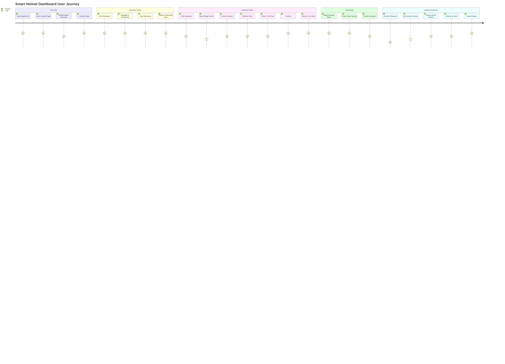

---

## 📡 Arduino Data Protocol

The firmware outputs **one JSON line per second** at **9600 baud**:

```json
{
  "gv": 1,
  "lat": 13.082700,
  "lng": 80.270700,
  "spd": 45.2,
  "alt": 50.5,
  "ax": 0.123,
  "ay": -0.456,
  "az": 9.810,
  "ta": 9.83,
  "ad": 0,
  "tmp": 0,
  "bat": 100,
  "mpu": 1,
  "ms": 45000
}
```

| Field | Key | Type | Unit | Description |
|-------|-----|------|------|-------------|
| GPS Valid | `gv` | `0\|1` | — | Explicit GPS fix flag (avoids false negatives at equator) |
| Latitude | `lat` | float | degrees | GPS latitude (0 when no fix) |
| Longitude | `lng` | float | degrees | GPS longitude (0 when no fix) |
| Speed | `spd` | float | km/h | GPS ground speed |
| Altitude | `alt` | float | meters | GPS altitude |
| Accel X | `ax` | float | m/s² | X-axis acceleration |
| Accel Y | `ay` | float | m/s² | Y-axis acceleration |
| Accel Z | `az` | float | m/s² | Z-axis acceleration (≈9.81 at rest) |
| Total Accel | `ta` | float | m/s² | √(ax² + ay² + az²) — magnitude |
| Accident | `ad` | `0\|1` | — | Accident detected flag |
| Temperature | `tmp` | int | °C | Reserved (placeholder, always 0) |
| Battery | `bat` | int | % | Reserved (placeholder, always 100) |
| MPU Status | `mpu` | `0\|1` | — | MPU6050 availability flag |
| Uptime | `ms` | ulong | ms | Arduino `millis()` for gap detection |

**Boot message** (sent once on startup):
```json
{"status": "boot", "msg": "MDP firmware ready"}
```

**Accident Detection Logic:**
- **Trigger**: `totalAccel > 25.0 m/s²` and no active alert
- **Alert**: 500ms on/off buzzer beep for 10 seconds
- **Cancel**: Press button (D7) — debounced at 200ms
- **Auto-clear**: Alert stops after 10 seconds if not manually cancelled

---

## ⚡ Performance

### Bundle Optimization

The dashboard uses **code splitting** and **vendor chunking** to minimize initial load:

| Metric | Before | After | Improvement |
|--------|--------|-------|-------------|
| Initial JS bundle | 1,246 KB | 238 KB | **81% smaller** |
| Lazy-loaded pages | 0 | 4 | Map, Analytics, Docs, Accidents |
| Vendor chunks | 1 monolith | 4 split | React, Leaflet, Recharts, PDF |

### React Optimization

| Technique | Where | Purpose |
|-----------|-------|---------|
| `React.memo` | Dashboard, Analytics, LiveMap | Skip re-renders when props unchanged |
| `useMemo` | AppContext Provider value, chartData, trail | Prevent cascading re-renders on 1 Hz updates |
| Data capping | `sensorHistory: 60`, `logs: 200`, `events: 500` | Prevent memory growth |
| Toast timer cleanup | ToastContext `Map` ref | Prevent timer leaks on unmount |
| Reduced backdrop blur | `blur(12px)` | Reduce compositor load |

### Firmware Memory Safety

| Concern | Solution |
|---------|----------|
| `String()` heap fragmentation | Replaced with `dtostrf()` + stack buffers |
| `Wire.read()` evaluation order UB | Read into `uint8_t` temporaries first |
| `Wire.requestFrom()` overload ambiguity | Cast all params to `uint8_t` |
| Cancel button bounce | 200ms software debounce |
| JSON document size | `StaticJsonDocument<300>` — fits 14 fields with 76-byte headroom |

### Design System

16 semantic CSS variables provide consistent styling across all components:

```
Color Palette: --color-{emerald, red, amber, blue, cyan, orange, purple, gray}
Status Backgrounds: --status-{emerald, red, amber, blue}-bg
Text Hierarchy: --text-primary, --text-secondary, --text-muted
Surfaces: --bg-primary, --bg-secondary, --glass-bg, --glass-border
```

All colors are optimized for dark mode with WCAG AA contrast compliance.

---

## ⚠️ Current Limitations

- **GSM/SIM not implemented** — The SIM module is part of the hardware design but no SIM card is currently available. Automated SOS messaging (sending GPS location to emergency contacts/hospitals) is not functional in this prototype.
- **No battery sensor** — `bat` field is always 100 (placeholder). Actual battery monitoring requires additional hardware.
- **No temperature sensor** — `tmp` field is always 0 (placeholder). Could be added with a DHT11/DHT22 module.
- **2KB SRAM constraint** — Arduino Uno limits sensor history and complex string operations. All allocations use stack buffers.
- **Single-helmet system** — Dashboard monitors one helmet at a time. Multi-helmet support would require server-side routing.

---

## 🔮 Future Scope

| Priority | Feature | Description |
|----------|---------|-------------|
| 🔴 High | **GSM/SIM Integration** | Send automated SOS messages with GPS coordinates to emergency contacts when accident is confirmed |
| 🔴 High | **Mobile App** | Companion app with push notifications and real-time monitoring |
| 🟡 Medium | **Cloud IoT Platform** | AWS IoT / Azure IoT Hub for persistent data logging and historical analysis |
| 🟡 Medium | **Machine Learning** | Driving behavior analysis, improved accident detection with false-positive reduction |
| 🟡 Medium | **Multi-Helmet Support** | Dashboard handles multiple helmets with rider identification |
| 🟢 Low | **PCB Design** | Compact form factor for embedding into production helmets |
| 🟢 Low | **Battery Management** | Rechargeable LiPo with INA219 current sensor and sleep modes |
| 🟢 Low | **Temperature Monitoring** | DHT22 module for ambient temperature sensing |
| 🟢 Low | **Geofencing** | Alert when rider leaves designated safe zones |

### Future Architecture Vision

```mermaid
graph TB
    subgraph Helmets["🏍️ Multiple Helmets"]
        H1["Helmet A<br/><i>ESP32 + LoRa</i>"]
        H2["Helmet B<br/><i>ESP32 + LoRa</i>"]
        H3["Helmet C<br/><i>ESP32 + LoRa</i>"]
    end
    
    subgraph Gateway["📡 LoRa Gateway"]
        GW["Raspberry Pi<br/><i>LoRaWAN</i>"]
    end
    
    subgraph Cloud["☁️ Cloud Platform"]
        IOT["AWS IoT Core"]
        DB["DynamoDB"]
        ML["SageMaker<br/><i>Anomaly Detection</i>"]
        SNS["SNS<br/><i>Notifications</i>"]
    end
    
    subgraph Clients["📱 Clients"]
        WEB["Web Dashboard"]
        APP["Mobile App"]
        SMS["SMS Gateway"]
    end
    
    H1 & H2 & H3 -->|"LoRa 915MHz"| GW
    GW -->|"MQTT"| IOT
    IOT --> DB
    IOT --> ML
    ML -->|"Accident Alert"| SNS
    SNS --> APP
    SNS --> SMS
    IOT --> WEB
    
    style Cloud fill:#0a2e3e,stroke:#06b6d4
    style Helmets fill:#2e1f0a,stroke:#f59e0b
```

---

## ♿ Accessibility

The dashboard is designed with accessibility in mind, following **WCAG 2.1 AA** guidelines.

### Keyboard Navigation

| Key | Action |
|-----|--------|
| `Tab` | Move focus to next interactive element |
| `Shift+Tab` | Move focus to previous element |
| `Enter` / `Space` | Activate buttons and links |
| `Escape` | Close modals and drawers |
| `Arrow Keys` | Navigate within menus and lists |

### Screen Reader Support

| Feature | Implementation |
|---------|----------------|
| **ARIA Labels** | All interactive elements have descriptive `aria-label` attributes |
| **Live Regions** | `aria-live="polite"` for toast notifications, `aria-live="assertive"` for accident alerts |
| **Role Attributes** | Semantic roles on custom components (`role="alert"`, `role="status"`, `role="navigation"`) |
| **Alt Text** | All images and icons have alternative text descriptions |
| **Heading Hierarchy** | Proper `h1` → `h6` hierarchy on all pages |

### Visual Accessibility

| Feature | Description |
|---------|-------------|
| **Color Contrast** | All text meets WCAG AA contrast ratio (≥4.5:1 for normal text, ≥3:1 for large text) |
| **Focus Indicators** | Visible `focus-visible` rings on all interactive elements (blue outline) |
| **Motion Reduction** | Respects `prefers-reduced-motion` media query for animations |
| **Scalable Text** | All text uses `rem` units, scales with browser font size settings |
| **Dark Mode Optimized** | High-contrast dark theme designed for extended use |

### Accessibility Testing

```bash
# Run accessibility audit (requires axe-core)
npm run test:a11y

# Manual testing checklist:
# ✅ Navigate entire app with keyboard only
# ✅ Test with VoiceOver (macOS) or NVDA (Windows)
# ✅ Test with browser zoom at 200%
# ✅ Test with high contrast mode
# ✅ Verify focus order matches visual order
```

---

## 🛡️ Security Considerations

| Area | Implementation |
|------|----------------|
| **CORS** | Server allows only `localhost:5173` and `localhost:5174` origins |
| **Rate Limiting** | 30 requests/minute per IP to prevent abuse |
| **Input Validation** | All incoming sensor data validated against schema |
| **XSS Prevention** | React's built-in XSS protection + no `dangerouslySetInnerHTML` |
| **No Secrets in Code** | No API keys or credentials in source code |
| **Dependencies** | Regular `npm audit` and dependabot alerts |

---

## 🧪 Testing

### Running Tests

```bash
# Unit tests (when available)
npm run test

# Type checking
npm run typecheck

# Lint
npm run lint

# Build (includes type check)
npm run build
```

### Manual Testing Checklist

| Area | Tests |
|------|-------|
| **Simulation Mode** | Start streaming, verify data updates, trigger accident, resolve alert |
| **Hardware Mode** | Connect Arduino, verify serial data, disconnect gracefully |
| **Navigation** | All sidebar links work, mobile menu opens/closes, collapse toggle |
| **Mode Toggle** | Switch between Simulation/Hardware, verify connection status |
| **Export** | Download CSV, generate PDF report |
| **Map** | Marker moves, trail draws, zoom controls work |
| **Charts** | Data populates, tooltips appear, responsive on resize |
| **Responsive** | Test at 320px, 768px, 1024px, 1440px widths |

---

## 📚 API Reference

### Bridge Server REST Endpoints

| Method | Endpoint | Description | Response |
|--------|----------|-------------|----------|
| `GET` | `/api/ports` | List available serial ports | `{ ports: ["COM3", "COM4"] }` |
| `POST` | `/api/connect` | Connect to serial port | `{ success: true, port: "COM3" }` |
| `POST` | `/api/disconnect` | Disconnect from port | `{ success: true }` |
| `GET` | `/api/status` | Get connection status | `{ connected: true, port: "COM3" }` |

### WebSocket Protocol

**Connection:** `ws://localhost:3001/ws`

**Incoming Messages (Server → Client):**
```json
{
  "type": "sensor_data",
  "payload": {
    "gpsValid": true,
    "latitude": 13.0827,
    "longitude": 80.2707,
    "speed": 45.2,
    "altitude": 120.5,
    "accelerometer": { "x": 0.12, "y": -0.45, "z": 9.81 },
    "totalAcceleration": 9.83,
    "accidentDetected": false,
    "battery": 100,
    "mpuStatus": true,
    "uptime": 45000
  }
}
```

**Client → Server Messages:**
```json
{ "type": "ping" }  // Keepalive
{ "type": "subscribe", "channel": "sensor_data" }
```

---

## 🤝 Contributing

We welcome contributions! Please follow these guidelines:

1. **Fork** the repository
2. **Create** a feature branch: `git checkout -b feature/amazing-feature`
3. **Commit** your changes: `git commit -m 'Add amazing feature'`
4. **Push** to the branch: `git push origin feature/amazing-feature`
5. **Open** a Pull Request

### Code Style

- TypeScript strict mode enabled
- ESLint configuration provided
- Prettier formatting (run `npm run format`)
- Use `verbatimModuleSyntax` for type imports (`import type`)

---

## 📜 License

This project is developed as part of a **Multidisciplinary Project (MDP)** at [Your University]. It is provided for academic and educational purposes.

---

<div align="center">

## 🏆 Project Showcase

<table>
<tr>
<td align="center" width="33%">

### 📊 Dashboard
Real-time metrics with glass-morphism design

</td>
<td align="center" width="33%">

### 🗺️ Live Map
GPS tracking with movement trail

</td>
<td align="center" width="33%">

### 📈 Analytics
60-second rolling time-series charts

</td>
</tr>
<tr>
<td align="center" width="33%">

### 📡 Sensor Data
Severity gauge + accelerometer readings

</td>
<td align="center" width="33%">

### 🚨 Accidents
Event log with full sensor snapshots

</td>
<td align="center" width="33%">

### 📟 Serial Monitor
macOS-style debug terminal

</td>
</tr>
</table>

---

**Built with ❤️ as a Multidisciplinary Project**

*Saving lives through technology — one helmet at a time.*

```
   ╔════════════════════════════════════════════════════════════╗
   ║                                                            ║
   ║   🏍️  S M A R T   S A F E T Y   H E L M E T  🏍️          ║
   ║                                                            ║
   ║   Real-Time IoT Accident Detection & Emergency Response   ║
   ║                                                            ║
   ╠════════════════════════════════════════════════════════════╣
   ║                                                            ║
   ║   Arduino Uno R3 · React 19 · TypeScript 5.9 · Node.js    ║
   ║   WebSocket · Leaflet · Recharts · TailwindCSS · Vite     ║
   ║                                                            ║
   ╚════════════════════════════════════════════════════════════╝
```

---

<sub>

**Smart Safety Helmet** © 2025 — Multidisciplinary Project (MDP)

[🔝 Back to Top](#-smart-safety-helmet)

</sub>

</div>
