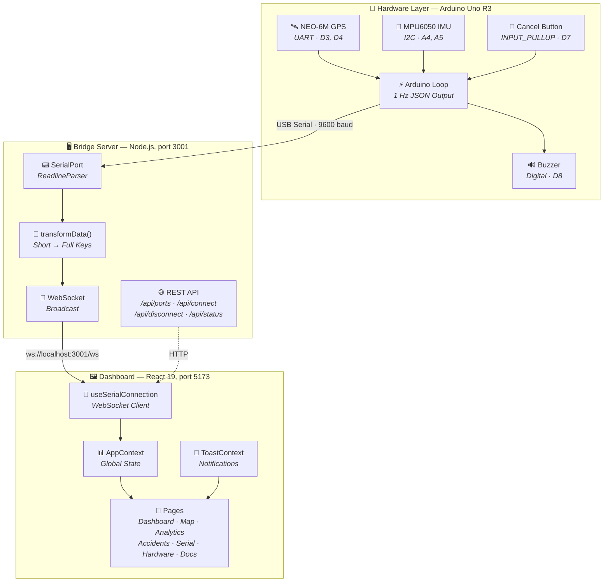
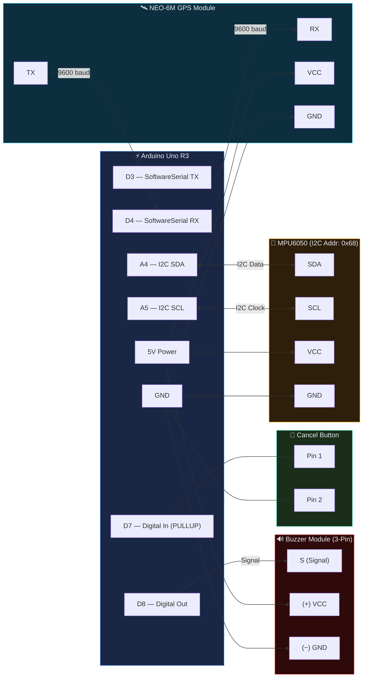

<div align="center">

# 🏍️ Smart Safety Helmet

### Real-Time IoT Accident Detection & Emergency Response System

[](https://www.arduino.cc/)
[](https://react.dev/)
[](https://www.typescriptlang.org/)
[](https://vite.dev/)
[](https://tailwindcss.com/)
[](https://nodejs.org/)
[]()

<br />

> **Many accident victims are unable to call for help due to severe injuries or unconsciousness, leading to critical delays in medical assistance.** This system automatically detects accidents and triggers emergency alerts — reducing response time and potentially saving lives.

<br />

</div>

---

## 📋 Table of Contents

- [Overview](#-overview)
- [Key Features](#-key-features)
- [System Architecture](#-system-architecture)
- [Tech Stack](#-tech-stack)
- [Project Structure](#-project-structure)
- [Getting Started](#-getting-started)
  - [Prerequisites](#prerequisites)
  - [Dashboard (React)](#1-dashboard-react)
  - [Bridge Server (Node.js)](#2-bridge-server-nodejs)
  - [Arduino Firmware](#3-arduino-firmware)
- [Hardware Wiring](#-hardware-wiring)
- [Usage Modes](#-usage-modes)
- [Dashboard Pages](#-dashboard-pages)
- [Arduino Data Protocol](#-arduino-data-protocol)
- [Performance](#-performance)
- [Current Limitations](#-current-limitations)
- [Future Scope](#-future-scope)

---

## 🔭 Overview

The **Smart Safety Helmet** is a Multidisciplinary Project (MDP) that integrates sensors into a safety helmet to continuously monitor a rider's movement. An **MPU6050 accelerometer/gyroscope** detects sudden impacts at **>25 m/s² (≈2.55g)**, triggering a **10-second buzzer alert** with a cancellable countdown.

The system consists of three layers:

| Layer | Tech | Role |
|-------|------|------|
| **Embedded Firmware** | Arduino Uno R3 + C++ | Sensor reading, accident detection, JSON output at 1 Hz |
| **Bridge Server** | Node.js + Express + WebSocket | Serial-to-WebSocket translation, port management, rate limiting |
| **Dashboard** | React 19 + TypeScript + Vite | Real-time visualization, analytics, accident history, PDF/CSV export |

Two operating modes are supported:
- **🧪 Simulation Mode** — No hardware required. Generates realistic GPS/accelerometer data around Chennai, India for development and testing.
- **🔧 Hardware Mode** — Connects to a real Arduino over USB serial and streams live sensor data from the helmet.

---

## ✨ Key Features

### Embedded System
- 🛰️ **GPS Tracking** — NEO-6M module with explicit validity flag (`gv` field)
- 📐 **6-Axis Motion Sensing** — MPU6050 raw I2C reads (±2g default scale)
- ⚠️ **Accident Detection** — 25 m/s² threshold with 10-second alert window
- 🔊 **Buzzer Alert** — 500ms on/off beep pattern during active alert
- 🛑 **Cancel Button** — Hardware debounced (200ms) manual alert cancellation
- 🩺 **Health Reporting** — `mpu` status flag, `ms` uptime, `bat` battery field
- 🧠 **Memory-Safe** — `dtostrf()` stack buffers instead of `String()` heap allocations (2KB SRAM safe)

### Dashboard
- 📊 **Real-Time Metrics** — GPS, speed, altitude, 3-axis acceleration, total accel, system status
- 🗺️ **Live Map** — Interactive Leaflet map with position marker and trail history
- 📈 **Analytics** — 60-second rolling charts for accelerometer, speed, and altitude
- 🚨 **Accident History** — Event log with GPS coordinates, peak acceleration, duration, resolution status
- 📟 **Serial Monitor** — macOS-style terminal with color-coded log messages
- 🔌 **Hardware Status** — Module connectivity and integration status panel
- 📖 **Documentation** — In-app project docs, abstract, and roadmap

### UI/UX
- 🌗 **Dark/Light Theme** — Persisted in `localStorage`, glass-morphism design system
- 📱 **Mobile Responsive** — Hamburger menu overlay, adaptive grid layouts
- 🎬 **Smooth Animations** — Page transitions, staggered fade-ins, gauge easing, pulse indicators
- 🔔 **Toast Notifications** — Success/error/warning/info toasts with 4-second auto-dismiss
- 📤 **Data Export** — CSV sensor logs + PDF system reports (jsPDF + AutoTable)
- ⚡ **Code-Split Bundle** — Lazy-loaded routes, vendor chunk splitting (81% smaller initial load)

### Server
- 🔄 **Serial ↔ WebSocket Bridge** — Transparent data translation
- 🛡️ **Rate Limiting** — 30 requests/minute per IP with auto-cleanup
- 📡 **REST API** — Port listing, connect/disconnect, status endpoints
- 🧹 **Resource Management** — Proper WebSocket cleanup, reconnection handling

---

## 🏗️ System Architecture

### Hardware Mode — Full Data Flow



### Simulation Mode


### Accident Detection Flow


---

## 🧰 Tech Stack

<table>
<tr><th>Layer</th><th>Technology</th><th>Version</th><th>Purpose</th></tr>
<tr><td rowspan="8"><strong>Frontend</strong></td><td>React</td><td>19.2</td><td>UI framework</td></tr>
<tr><td>TypeScript</td><td>5.9</td><td>Type safety</td></tr>
<tr><td>Vite</td><td>7.2</td><td>Build tool & dev server</td></tr>
<tr><td>Tailwind CSS</td><td>4.1</td><td>Utility-first CSS</td></tr>
<tr><td>React Router</td><td>7.13</td><td>Client-side routing</td></tr>
<tr><td>Recharts</td><td>3.7</td><td>Data visualization</td></tr>
<tr><td>Leaflet + React-Leaflet</td><td>1.9 / 5.0</td><td>Interactive maps</td></tr>
<tr><td>jsPDF + AutoTable</td><td>4.1 / 5.0</td><td>PDF report generation</td></tr>
<tr><td rowspan="4"><strong>Server</strong></td><td>Node.js</td><td>18+</td><td>Runtime</td></tr>
<tr><td>Express</td><td>4.21</td><td>REST endpoints</td></tr>
<tr><td>ws</td><td>8.18</td><td>WebSocket server</td></tr>
<tr><td>serialport</td><td>12.0</td><td>USB serial communication</td></tr>
<tr><td rowspan="4"><strong>Firmware</strong></td><td>Arduino Uno R3</td><td>—</td><td>MCU (ATmega328P, 2KB SRAM)</td></tr>
<tr><td>TinyGPS++</td><td>Latest</td><td>NMEA GPS parsing</td></tr>
<tr><td>ArduinoJson</td><td>6.x</td><td>JSON serialization</td></tr>
<tr><td>Wire.h</td><td>Built-in</td><td>I2C communication</td></tr>
</table>

---

## 📁 Project Structure

```
mdp/
├── arduino/
│   └── mdp_firmware/
│       └── mdp_firmware.ino        # Arduino sketch (GPS + MPU6050 + accident detection)
│
├── server/
│   ├── server.js                   # Bridge server (serial ↔ WebSocket + REST API)
│   └── package.json                # Server dependencies
│
├── src/
│   ├── components/
│   │   ├── AccelerationGauge.tsx   # SVG circular gauge (0-30 m/s², 3-zone colors)
│   │   ├── ConnectionPanel.tsx     # Serial port connection UI
│   │   ├── DashboardLayout.tsx     # Responsive layout with sidebar + mobile menu
│   │   ├── GlassCard.tsx           # Glass-morphism container component
│   │   ├── MetricCard.tsx          # Data display card with icon + pulse indicator
│   │   ├── Sidebar.tsx             # Navigation, theme toggle, exports, mode switch
│   │   └── StatusBadge.tsx         # Color-coded status indicators
│   │
│   ├── context/
│   │   ├── AppContext.tsx           # Global state (sensors, theme, mode, accidents)
│   │   └── ToastContext.tsx         # Toast notification system
│   │
│   ├── hooks/
│   │   └── useSerialConnection.ts  # WebSocket client hook (auto-reconnect)
│   │
│   ├── pages/
│   │   ├── Dashboard.tsx           # Main metrics dashboard
│   │   ├── LandingPage.tsx         # Welcome page with feature showcase
│   │   ├── LiveMap.tsx             # GPS map with trail (lazy-loaded)
│   │   ├── Analytics.tsx           # Rolling charts (lazy-loaded)
│   │   ├── AccidentHistory.tsx     # Event log with stats (lazy-loaded)
│   │   ├── SerialMonitor.tsx       # Terminal-style log viewer
│   │   ├── HardwareStatus.tsx      # Module status panel
│   │   └── Documentation.tsx       # In-app docs (lazy-loaded)
│   │
│   ├── types/
│   │   └── index.ts                # TypeScript interfaces (SensorData, AccidentEvent, etc.)
│   │
│   └── utils/
│       ├── simulator.ts            # Simulation data generator
│       └── reportGenerator.ts      # CSV + PDF export utilities
│
├── public/                         # Static assets
├── index.html                      # Entry HTML
├── vite.config.ts                  # Vite config with vendor chunk splitting
├── tsconfig.json                   # TypeScript base config
├── tsconfig.app.json               # App-specific TS config (verbatimModuleSyntax)
├── eslint.config.js                # ESLint configuration
└── package.json                    # Frontend dependencies
```

---

## 🚀 Getting Started

### Prerequisites

| Tool | Version | Required For |
|------|---------|-------------|
| [Node.js](https://nodejs.org/) | 18+ | Dashboard + Bridge Server |
| [npm](https://www.npmjs.com/) | Included with Node.js | Package management |
| [Arduino IDE](https://www.arduino.cc/en/software) | 2.x | Flashing firmware (hardware mode only) |

### 1. Dashboard (React)

```bash
# Clone and install
git clone https://github.com/pratyushdeosingh/mdp.git
cd mdp
npm install

# Start development server
npm run dev
```

Opens at **http://localhost:5173** — works immediately in Simulation Mode.

### 2. Bridge Server (Node.js)

> Only needed for Hardware Mode. Skip this for simulation.

```bash
cd server
npm install
node server.js
```

```
╔══════════════════════════════════════════════════╗
║   MDP IoT Serial Bridge Server                   ║
║   Running on http://localhost:3001               ║
║                                                    ║
║   REST:  http://localhost:3001/api/ports         ║
║   WS:    ws://localhost:3001/ws                  ║
╚══════════════════════════════════════════════════╝
```

### 3. Arduino Firmware

1. Open `arduino/mdp_firmware/mdp_firmware.ino` in the Arduino IDE
2. Install required libraries via **Library Manager**:
   - `TinyGPS++` by Mikal Hart
   - `ArduinoJson` by Benoît Blanchon (v6.x)
3. Select **Arduino Uno** as the board
4. Select the correct COM port
5. Click **Upload**
6. Verify output at `9600` baud in Serial Monitor

---

## 🔌 Hardware Wiring

### Circuit Diagram



### Pin Mapping Table

| Component | Arduino Pin | Interface | Direction | Notes |
|-----------|-------------|-----------|-----------|-------|
| NEO-6M GPS TX | **D4** | SoftwareSerial RX | GPS → Arduino | 9600 baud UART |
| NEO-6M GPS RX | **D3** | SoftwareSerial TX | Arduino → GPS | 9600 baud UART |
| MPU6050 SDA | **A4** | I2C Data | Bidirectional | Address: `0x68` |
| MPU6050 SCL | **A5** | I2C Clock | Bidirectional | |
| Buzzer Signal (S) | **D8** | Digital Out | Arduino → Buzzer | Signal pin, 500ms on/off pattern |
| Buzzer Power (+) | **5V** | Power | Arduino → Buzzer | VCC pin |
| Buzzer Ground (−) | **GND** | Ground | — | GND pin |
| Cancel Button Pin 1 | **D7** | Digital In | Button → Arduino | `INPUT_PULLUP`, active LOW |
| Cancel Button Pin 2 | **GND** | Ground | — | Connect other leg to GND |
| NEO-6M VCC | **5V** | Power | Arduino → GPS | 3.3V or 5V depending on module |
| MPU6050 VCC | **5V** | Power | Arduino → MPU | 3.3V or 5V depending on module |

> ⚡ Power MPU6050 and NEO-6M from Arduino **3.3V or 5V** depending on your module variant. Both share the same power rail.

---

## 🎮 Usage Modes

### 🧪 Simulation Mode (No Hardware)

1. Run `npm run dev`
2. Open **http://localhost:5173**
3. Select **Simulation Mode** on the landing page
4. Click **Start Streaming** — simulated data flows immediately

The simulator generates GPS coordinates around **Chennai, India** with realistic accelerometer noise and periodic accident events.

### 🔧 Hardware Mode (Arduino Connected)

1. Flash the Arduino firmware (see above)
2. Connect Arduino to PC via USB
3. Start the bridge server: `cd server && node server.js`
4. Start the dashboard: `npm run dev` (from project root)
5. Open **http://localhost:5173**
6. Select **Hardware Mode**
7. Click **Refresh Ports** → select your COM port → **Connect**
8. Live sensor data streams at 1 Hz

---

## 📄 Dashboard Pages

| Page | Route | Description |
|------|-------|-------------|
| 🏠 **Landing** | `/` | Feature showcase, mode selection, tech stack overview |
| 📊 **Dashboard** | `/dashboard` | Real-time metrics — GPS, speed, altitude, acceleration, circular gauge, accident alert banner |
| 🗺️ **Live Map** | `/map` | Interactive Leaflet map with live marker + movement trail |
| 📈 **Analytics** | `/analytics` | 60-second rolling charts — acceleration, speed, altitude time series |
| 🚨 **Accidents** | `/accidents` | Event history log with summary stats, GPS, peak accel, duration per event |
| 📟 **Serial** | `/serial` | macOS-style terminal viewer with color-coded log messages |
| 🔌 **Hardware** | `/hardware` | Module status (GPS, MPU6050, Buzzer, Button) with connectivity badges |
| 📖 **Docs** | `/docs` | In-app documentation, project abstract, and roadmap |

---

## 📡 Arduino Data Protocol

The firmware outputs **one JSON line per second** at **9600 baud**:

```json
{
  "gv": 1,
  "lat": 13.082700,
  "lng": 80.270700,
  "spd": 45.2,
  "alt": 50.5,
  "ax": 0.123,
  "ay": -0.456,
  "az": 9.810,
  "ta": 9.83,
  "ad": 0,
  "tmp": 0,
  "bat": 100,
  "mpu": 1,
  "ms": 45000
}
```

| Field | Key | Type | Unit | Description |
|-------|-----|------|------|-------------|
| GPS Valid | `gv` | `0\|1` | — | Explicit GPS fix flag (avoids false negatives at equator) |
| Latitude | `lat` | float | degrees | GPS latitude (0 when no fix) |
| Longitude | `lng` | float | degrees | GPS longitude (0 when no fix) |
| Speed | `spd` | float | km/h | GPS ground speed |
| Altitude | `alt` | float | meters | GPS altitude |
| Accel X | `ax` | float | m/s² | X-axis acceleration |
| Accel Y | `ay` | float | m/s² | Y-axis acceleration |
| Accel Z | `az` | float | m/s² | Z-axis acceleration (≈9.81 at rest) |
| Total Accel | `ta` | float | m/s² | √(ax² + ay² + az²) — magnitude |
| Accident | `ad` | `0\|1` | — | Accident detected flag |
| Temperature | `tmp` | int | °C | Reserved (placeholder, always 0) |
| Battery | `bat` | int | % | Reserved (placeholder, always 100) |
| MPU Status | `mpu` | `0\|1` | — | MPU6050 availability flag |
| Uptime | `ms` | ulong | ms | Arduino `millis()` for gap detection |

**Boot message** (sent once on startup):
```json
{"status": "boot", "msg": "MDP firmware ready"}
```

**Accident Detection Logic:**
- **Trigger**: `totalAccel > 25.0 m/s²` and no active alert
- **Alert**: 500ms on/off buzzer beep for 10 seconds
- **Cancel**: Press button (D7) — debounced at 200ms
- **Auto-clear**: Alert stops after 10 seconds if not manually cancelled

---

## ⚡ Performance

### Bundle Optimization

The dashboard uses **code splitting** and **vendor chunking** to minimize initial load:

| Metric | Before | After | Improvement |
|--------|--------|-------|-------------|
| Initial JS bundle | 1,246 KB | 238 KB | **81% smaller** |
| Lazy-loaded pages | 0 | 4 | Map, Analytics, Docs, Accidents |
| Vendor chunks | 1 monolith | 4 split | React, Leaflet, Recharts, PDF |

### Firmware Memory Safety

| Concern | Solution |
|---------|----------|
| `String()` heap fragmentation | Replaced with `dtostrf()` + stack buffers |
| `Wire.read()` evaluation order UB | Read into `uint8_t` temporaries first |
| `Wire.requestFrom()` overload ambiguity | Cast all params to `uint8_t` |
| Cancel button bounce | 200ms software debounce |
| JSON document size | `StaticJsonDocument<300>` — fits 14 fields with 76-byte headroom |

---

## ⚠️ Current Limitations

- **GSM/SIM not implemented** — The SIM module is part of the hardware design but no SIM card is currently available. Automated SOS messaging (sending GPS location to emergency contacts/hospitals) is not functional in this prototype.
- **No battery sensor** — `bat` field is always 100 (placeholder). Actual battery monitoring requires additional hardware.
- **No temperature sensor** — `tmp` field is always 0 (placeholder). Could be added with a DHT11/DHT22 module.
- **2KB SRAM constraint** — Arduino Uno limits sensor history and complex string operations. All allocations use stack buffers.
- **Single-helmet system** — Dashboard monitors one helmet at a time. Multi-helmet support would require server-side routing.

---

## 🔮 Future Scope

| Priority | Feature | Description |
|----------|---------|-------------|
| 🔴 High | **GSM/SIM Integration** | Send automated SOS messages with GPS coordinates to emergency contacts when accident is confirmed |
| 🔴 High | **Mobile App** | Companion app with push notifications and real-time monitoring |
| 🟡 Medium | **Cloud IoT Platform** | AWS IoT / Azure IoT Hub for persistent data logging and historical analysis |
| 🟡 Medium | **Machine Learning** | Driving behavior analysis, improved accident detection with false-positive reduction |
| 🟡 Medium | **Multi-Helmet Support** | Dashboard handles multiple helmets with rider identification |
| 🟢 Low | **PCB Design** | Compact form factor for embedding into production helmets |
| 🟢 Low | **Battery Management** | Rechargeable LiPo with INA219 current sensor and sleep modes |
| 🟢 Low | **Temperature Monitoring** | DHT22 module for ambient temperature sensing |
| 🟢 Low | **Geofencing** | Alert when rider leaves designated safe zones |

---

<div align="center">

**Built with ❤️ as a Multidisciplinary Project**

*Saving lives through technology — one helmet at a time.*

</div>
